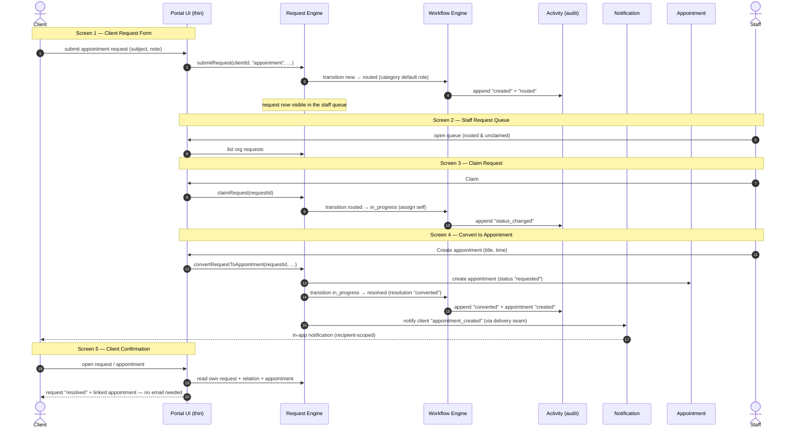

# Appointment Request Slice — Implementation Workflow

- **Status:** Architecture-approved (2026-08-05). Scope-locked to the five screens below — **do not expand**.
- **Ref:** [`adr/0001-request-engine.md`](./adr/0001-request-engine.md), [`Workflow-Engine.md`](./Workflow-Engine.md), data layer `templates/supabase/008_requests.sql`, lifecycle `templates/lib/requests.ts`.
- **Objective:** put a working end-to-end loop in front of Rosa to **validate the architecture** — not to ship a polished production interface. The UI is a **thin presentation layer over the engines**; no business logic lives in the interface.

## Acceptance criterion

> A brand new client can submit an appointment request, authorized staff can claim and convert it into an appointment, the request lifecycle is completed correctly, Activity Events are recorded at every transition, and the client receives confirmation without leaving the platform.

The slice is **done** when that sentence is demonstrably true end-to-end (see [Definition of done](#definition-of-done)).

## Customer journey — traced through every engine

This is the implementation contract: each step names the **engine** that owns it. The UI only calls the engine functions already shipped in `lib/requests.ts`; it never writes `status`, never inserts an appointment, never composes a notification itself.

**Engine ownership at a glance:** Request Engine owns intake/routing/lifecycle; Workflow Engine owns every legal transition; Activity records each transition immutably; Notification delivers the confirmation; Appointment is the conversion target (its own machine); the Client Confirmation view is a read across Request + relation + Appointment. The **Permission Engine** is orthogonal and present at every hop — route guards on the layouts, `guardedAction`/RLS on every mutation.

## Screen ↔ engine map

| # | Screen (route) | Request | Workflow | Activity | Notification | Appointment | Permission |
|---|---|---|---|---|---|---|---|
| 1 | Client Request Form `/(client)/requests/new` | `submitRequest()` | `new → routed` | created + routed | — | — | client layout `requireContext`; RLS `requests_own_insert` (own client, `new` only) |
| 2 | Staff Request Queue `/(staff)/requests` | list org requests | shows status; queue = `routed` unclaimed | — | *(optional badge)* | — | staff layout `requireCapability('clients.read')`; RLS staff read |
| 3 | Claim Request (action) | `claimRequest()` | `routed → in_progress` (assign self) | status_changed | — | — | `guardedAction('engagements.write')` + RLS staff update |
| 4 | Convert to Appointment `/(staff)/requests/[id]` | `convertRequestToAppointment()` | `in_progress → resolved` (converted) | converted + appt created | client `appointment_created` | create appt (`requested`) + `request_relations` link | `guardedAction('appointments.write')` + RLS staff |
| 5 | Client Confirmation `/(client)/requests/[id]` | read own request + relation | shows `resolved` + appt status | *(v1: status only)* | confirmation appears in client notifications | linked appointment shown | client layout; RLS `requests_own_read` / `request_relations_own_read` |

## Implementation constraints

- **Thin presentation only.** Screens render engine outputs and call engine functions. No status writes, no appointment inserts, no notification composition, no transition logic in a component or route handler. If a screen needs new behavior, it goes in an engine (`lib/requests.ts`), not the UI.
- **Reuse the shipped surface:** `dashboard-layout.tsx` + `portalnav` for chrome; `authz.ts` guards for access; `lib/requests.ts` (`submitRequest`, `claimRequest`, `convertRequestToAppointment`) for every mutation; `lib/notifications.ts` seam for delivery.
- **Server Actions** for mutations (each wrapped by the permission gate); server components for reads. Minimal Tailwind; no client-side state libraries.
- **Scope lock:** these five screens only. No correspondence UI, no category editor, no queue filters/sorting beyond newest-first, no SMS/email, no polish pass.

## Definition of done

Mapped 1:1 to the acceptance criterion, verifiable in a Rosa walkthrough:

1. **New client submits** — a freshly created client account creates a request via Screen 1; row appears with `status=routed`.
2. **Authorized staff claim + convert** — staff (not client) claims (Screen 3) and converts (Screen 4); a client attempting either is refused (app guard + RLS).
3. **Lifecycle completes correctly** — request ends `resolved` / `resolution=converted`; an appointment exists, linked via `request_relations`.
4. **Activity at every transition** — `activity_events` contains `created`, `routed`, `status_changed` (claim), `converted` (+ appointment `created`) for the request.
5. **Confirmation without leaving the platform** — the client sees the resolved request and linked appointment on Screen 5, and the `appointment_created` notification in-app — no email/phone step.
