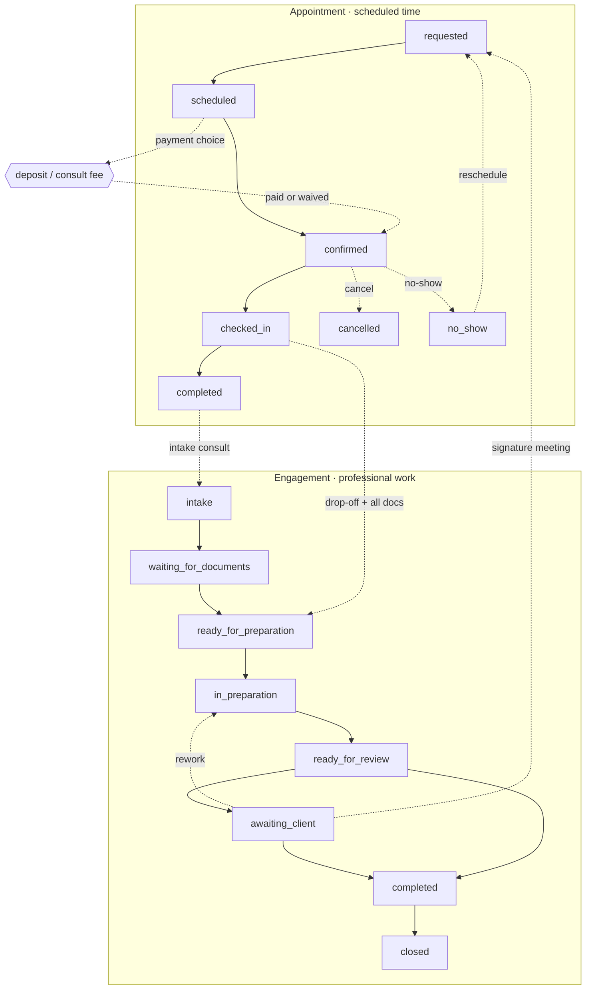

# Architecture — Baseline Practice OS

The reusable architecture behind Baseline Studio's multi-role client platforms. Read this first; the other docs go deep on each layer.

## Product vision
**Baseline Practice OS** is one platform that a professional-services business runs its whole front office on: their clients log in to book, pay, upload, and track work; their staff run a day view, prep folders, collect payment, and move work through a queue. Build the core once, then ship an **industry module** (CPA first) per client by editing configuration and domain tables — not by rebuilding.

Success looks like: a new client platform starts at ~60% done, one engineer stands up a working vertical slice in days, and the same auth/roles/workflow/notification spine serves a CPA, a clinic, or a law firm.

## Shared core vs. industry modules
Two layers, kept deliberately apart:

- **Shared core** — everything every professional-services business needs, identical across industries:
  - **`organizations` + `org_id` on every table** (multi-tenant-ready from day one, even single-tenant)
  - identity & auth (`profiles`, roles / `user_roles`)
  - the **workflow** engine (states, transitions, guards) — appointments and engagements as separate, connected state machines
  - `appointments`, `payments`, `tasks`, `notifications`
  - `activity_events` (audit history)
  - the portal shell, navigation, shared loaders, design tokens
- **Industry module** — the domain-specific shape for one vertical:
  - CPA: `engagements`, tax-document metadata, `consultation_requests`, the four CPA roles, service catalog
  - swapped per client; never leaks industry assumptions into the core

Rule of thumb: if a clinic and a law firm would both need it, it's core. If only the CPA needs it, it's a module. See [`Industry-Modules.md`](./Industry-Modules.md).

## Client customization layer
On top of core + module sits per-client config — the cheap-to-change layer:
- **Brand tokens** (colors, fonts, logo mark)
- **Service catalog** (`services` rows: names, durations, fees, deposits)
- **Role → nav** mapping (which sections each portal shows)
- **Copy & metadata** (titles, OG card, notification templates)

Customizing a client should mean editing this layer and the module's domain tables — not touching the core.

## Recommended Next.js + Supabase architecture
- **Next.js 14 App Router**, **TypeScript**, server components + **server actions** for all mutations.
- **Supabase**: Postgres (data), Auth (identity), Storage (private files, signed URLs).
- **Four Supabase clients** (`lib/supabase/`): `server` (RSC/actions, user-scoped), `client` (browser), `admin` (service-role, server-only), `middleware` (session refresh).
- **One shared loader per role** (`lib/<role>-data.ts`) so every section renders one consistent truth.
- **Tailwind** with brand tokens; a role-based **Shell** (sidebar + top bar) chosen by `profile.role`.
- **Netlify** deploy with `@netlify/plugin-nextjs`.

```text
Browser ─▶ Next.js (RSC + server actions)
                │  server-side authz (app layer)
                ▼
           Supabase  ── Postgres (+ RLS = backstop)
                     ── Auth
                     ── Storage (private + signed URLs)
```

## The end-to-end workflow
The vertical slice every Practice OS build implements first — from a client's request to a completed engagement. It runs as **two connected state machines**: the *appointment* (scheduled time) and the *engagement* (the professional work). They advance independently and couple through guards.



Full state/transition/guard model for both machines — and exactly how they couple — is in [`Workflow-Engine.md`](./Workflow-Engine.md).

## Data-first & vertical-slice principles
- **Data-first.** Model the minimum required data — entities, relationships, statuses, transitions, permissions, RLS, grants, ownership, audit history — *before* building screens. A screen built on a wrong model is thrown away.
- **Vertical slice.** Build the one workflow above end-to-end (every role, every state) before fanning out to all dashboard pages. A working spine de-risks everything after it.
- **Core/module separation** from day one, so the second industry doesn't force a rewrite.

## Definition of done (per feature)
A feature is done when:
1. Data model + migration merged (schema, **RLS**, **grants**, indexes).
2. Mutation enforced **server-side** *and* by **RLS**.
3. Meaningful changes write an **activity event**.
4. Loading, empty, and error states handled in the UI.
5. Works on mobile.
6. Notifications fire where the workflow expects them (and are logged).
7. Reviewed via the preview harness screenshots; harness removed from the diff.

## Security principles
- **Two-layer authorization**: server-side app logic is the gate, RLS is the backstop. Never one alone.
- **Service-role key is server-only**, never shipped to the browser, used only for deliberate admin operations (create/delete user). See [`Permission-System.md`](./Permission-System.md).
- **Private storage** by default; serve files through short-lived signed URLs, never public buckets.
- **Least data**: don't store sensitive documents you can instead link from a secure provider.
- **Tenant scoping from day one**: ship the `organizations` table and an `org_id` on every table even for a single-tenant client, and scope every query, RLS policy, and helper by the caller's org. Going multi-tenant then adds a filter, not a rewrite. See [`Permission-System.md`](./Permission-System.md).
- **Hardened public intake**: the only anonymous entry point (`consultation_requests`) is insert-only through a server-validated, rate-limited, bot-checked path — **no anonymous read**. See [`Permission-System.md`](./Permission-System.md).

## Deployment overview
- **Netlify** site per client, `@netlify/plugin-nextjs`.
- Env: `NEXT_PUBLIC_SUPABASE_URL`, `NEXT_PUBLIC_SUPABASE_ANON_KEY`, `SUPABASE_SERVICE_ROLE_KEY` (secret), `NEXT_PUBLIC_SITE_URL`.
- Supabase migrations run in order (schema → RLS → grants → storage). The three usual misses: storage bucket policies, table **grants** to `authenticated` (RLS ≠ grants), and temp-password onboarding when SMTP isn't configured. See `../references/gotchas.md`.
