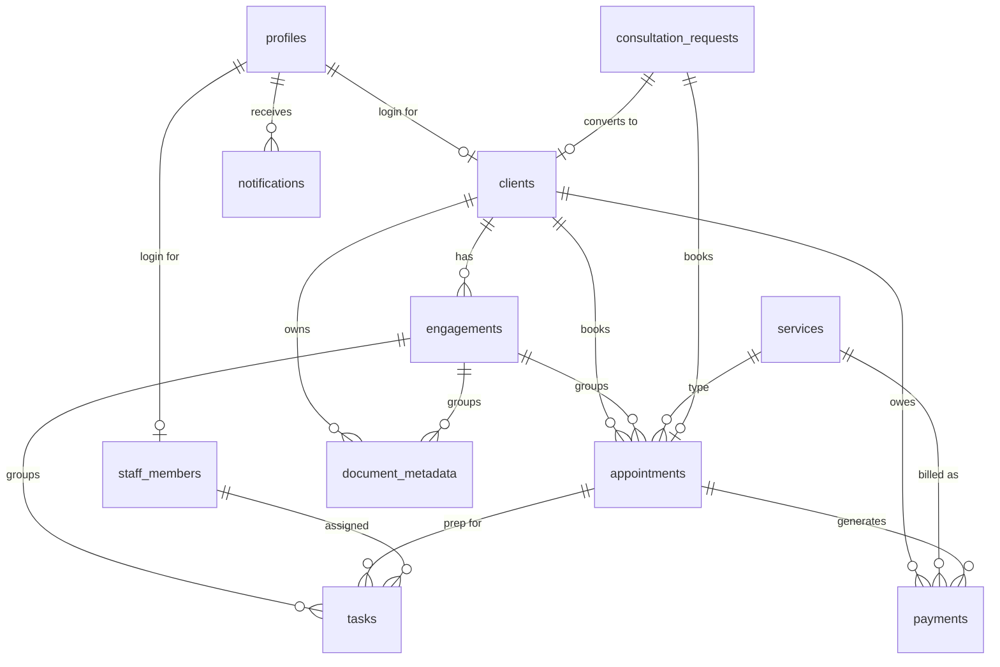

# Data Model — Baseline Practice OS

Model the data before the screens. This is the shape to lock first: entities, relationships, statuses, transitions, audit history, and deletion policy.

## Core reusable entities (every industry)

| Entity | Purpose |
|---|---|
| `profiles` | One row per login. Extends Supabase `auth.users`. Holds `role` (MVP) or joins to `user_roles`. |
| `user_roles` *(optional)* | Join table when a person can hold multiple responsibilities. See [`Permission-System.md`](./Permission-System.md). |
| `clients` | The business's customers. **Exists with or without a login** — a walk-in is a client too; a `profile_id` links a login when they have one. |
| `staff_members` | Internal people + their job title; usually a `profile_id` plus practice metadata. |
| `services` | The bookable/billable menu: duration, fee, deposit. |
| `appointments` | Scheduled time between a client and staff. The day-view spine. |
| `payments` | Deposits, fees, invoices. Manual-first, provider-ready. |
| `tasks` | Internal prep/work items, optionally tied to an appointment or engagement. |
| `notifications` | One row per recipient per event; in-app now, email/SMS later. |
| `activity_events` | **Audit history** — an append-only log of meaningful changes. |

## CPA-specific entities (the first module)

| Entity | Purpose |
|---|---|
| `engagements` | A client's service job/case (a tax return, an audit). Groups appointments, tasks, documents, payments under one unit of work. |
| `document_metadata` | Record of a client document: name, folder, tax year, storage path **or** external secure link. |
| `consultation_requests` | Public intake before someone is a client; triaged and converted. |

Other CPA roles/records (`client`, `receptionist`, `tax_preparer`, `cpa_admin`; service catalog) sit on the core entities above.

## Entity relationships
- `profiles` **1—1** `clients.profile_id` (optional) and `staff_members.profile_id`.
- `clients` **1—many** `engagements`, `appointments`, `payments`, `document_metadata`.
- `engagements` **1—many** `appointments`, `tasks`, `document_metadata`, `payments` (an engagement is the umbrella for a job).
- `services` **1—many** `appointments`, `payments`.
- `appointments` **1—many** `tasks`, `payments`.
- `consultation_requests` **0—1** `clients`, **0—1** `appointments` (set on conversion).
- `activity_events` **many—1** any entity via a soft reference (`entity_type` + `entity_id`).
- `notifications` **many—1** `profiles` (recipient).

See the ER diagram below.

## MVP ER diagram



## Suggested status values
Keep status sets as `CHECK` constraints (extend with a one-line `ALTER`, no enum migration):

- **appointments.status**: `requested · scheduled · confirmed · checked_in · in_progress · completed · no_show · cancelled`
- **payments.status**: `pending · paid · failed · refunded · void`
- **tasks.status**: `todo · in_progress · done · blocked`
- **document_metadata.status**: `requested · uploaded · reviewed · needs_attention`
- **engagements.status**: `open · in_progress · in_review · completed · closed`
- **consultation_requests.status**: `new · contacted · scheduled · converted · declined · spam`

## Status-transition rules
Don't allow arbitrary jumps. Encode legal transitions (enforced in the workflow layer, see [`Workflow-Engine.md`](./Workflow-Engine.md)):

- appointment: `requested → scheduled → confirmed → checked_in → in_progress → completed`; from any pre-`checked_in` state → `cancelled`; from `confirmed` (past start, no check-in) → `no_show`.
- payment: `pending → paid`; `pending → failed`; `paid → refunded`; `pending → void`.
- engagement advances only when its gating tasks/documents are satisfied (a **guard**).

Every transition writes an **activity event**.

## Audit history pattern
Store meaningful changes, don't just overwrite `status`:

```text
activity_events (
  id            uuid pk,
  entity_type   text,        -- 'appointment' | 'engagement' | 'payment' | ...
  entity_id     uuid,
  actor_id      uuid,        -- profile who caused it (null = system/automation)
  verb          text,        -- 'status_changed' | 'created' | 'document_uploaded'
  from_status   text,        -- nullable
  to_status     text,        -- nullable
  metadata      jsonb,       -- anything extra
  created_at    timestamptz default now()
)
```

- Append-only; never update or delete rows.
- Write one on every workflow transition, payment change, document upload, assignment.
- Powers the client-facing timeline, the admin history view, and dispute resolution.
- `status` on the entity is the *current* value; `activity_events` is *how it got there*.

## Soft deletion vs. hard deletion
- **Soft delete** (a `deleted_at timestamptz` column, filtered out of loaders) for anything with history or references: `clients`, `engagements`, `appointments`, `payments`. Preserves the audit trail and avoids dangling references.
- **Hard delete** only for throwaway rows with no downstream meaning (e.g. a `spam` consultation request) or when a legal/privacy requirement demands actual erasure.
- Deleting a **login** (auth user) is a real operation via the service-role client — cascade children and clean up storage. Deleting the *client record* should usually be a soft delete.

## Naming conventions
- Tables: plural, snake_case (`consultation_requests`).
- Columns: snake_case; foreign keys `<entity>_id` (`client_id`, `engagement_id`).
- Timestamps: `created_at`, `updated_at`, `*_at` for events (`checked_in_at`, `completed_at`).
- Status columns: `status` (+ `CHECK`); booleans read as facts (`requires_deposit`).
- Soft delete: `deleted_at` (null = live).

## External secure-document systems
For regulated documents (tax records, PHI, legal files), **prefer linking over storing**:
- Store **metadata + a link** to an existing secure provider the client already uses (e.g. a portal/DMS), not the bytes.
- `document_metadata` then carries `external_url` (+ provider, requested/received status) instead of `storage_path`.
- **Do not store sensitive tax documents unnecessarily** if a secure provider is being linked — every document you hold is liability you now own. Only store bytes in the private Supabase bucket when there is no secure provider and the client accepts it.
- When you do store: private bucket, signed URLs, least-access RLS, and a retention/deletion policy.
