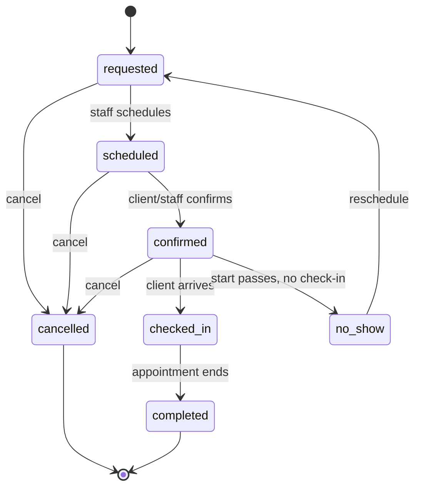
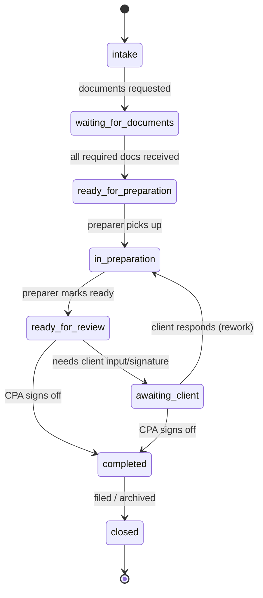

# Workflow Engine — Baseline Practice OS

A **workflow** is a state-driven business process. This is how Practice OS moves an engagement from request to completion without ad-hoc `status = '...'` writes scattered across the codebase.

The CPA module runs **two separate but connected state machines**: an **appointment** manages *scheduled time*, an **engagement** manages *the professional work*. They advance independently and couple at defined points — one engagement can have many appointments over its life (an intake consult, a document drop-off, a signature meeting). Modeling them as one machine was the earlier mistake; keep them distinct.

## The five pieces
- **State** — where an entity is (`appointments.status`, `engagements.status`).
- **Transition** — a legal move from one state to another (`confirmed → checked_in`). Illegal moves are rejected.
- **Trigger** — what starts a transition: a user action (client checks in), a schedule (start time passes with no check-in), or an event (payment succeeds).
- **Action** — side effects a transition runs: create a task, send a notification, write an activity event.
- **Guard** — a precondition that must hold for a transition to fire (deposit paid before `confirmed`; required documents received before a preparer can start).

Model transitions in one place (a `transition(entity, to, ctx)` function per workflow) so guards, actions, and audit writes are consistent — never scatter raw status updates.

## Machine 1 — appointment lifecycle (scheduled time)
An appointment is a single scheduled touchpoint. Its states manage *time*, not work.

States: `requested · scheduled · confirmed · checked_in · completed · cancelled · no_show`

| From | Trigger | Guard | To | Actions |
|---|---|---|---|---|
| — | client requests a time | — | `requested` | create appointment (link `engagement_id` if one exists); notify receptionist |
| `requested` | staff schedules | slot free | `scheduled` | **create the payment obligation (`payments.status = 'pending'`) if the service carries a fee**; write event |
| `scheduled` | client/staff confirms | **the obligation is `paid` *or* waived *or* there is no fee** | `confirmed` | notify client; write event |
| `confirmed` | client arrives | — | `checked_in` | signal the engagement (see coupling); write event |
| `checked_in` | appointment ends | — | `completed` | write event |
| `requested`/`scheduled`/`confirmed` | cancel | — | `cancelled` | release slot; notify other party; apply refund policy; write event |
| `confirmed` | start passes, no check-in (scheduled sweep) | — | `no_show` | notify receptionist; deposit policy; offer reschedule; write event |

`completed` here means only *the meeting happened* — the professional work lives on the engagement machine.

**Payment ordering.** The obligation is **created before** it is checked: a `pending` `payments` row is written when the fee-bearing appointment is *scheduled*, and the `scheduled → confirmed` guard only *reads* whether that obligation is `paid` (or waived). Never create the payment on the same transition whose guard depends on it. (The paid-consultation flow below follows the same rule — obligation, then payment, then schedule.)

## Machine 2 — engagement lifecycle (the professional work)
An engagement is one professional job (a tax return). Its states manage *work*, and it outlives any single appointment.

States: `intake · waiting_for_documents · ready_for_preparation · in_preparation · ready_for_review · awaiting_client · completed · closed`

| From | Trigger | Guard | To | Actions |
|---|---|---|---|---|
| — | consultation converts / job opened | — | `intake` | create engagement; notify assigned staff |
| `intake` | receptionist requests documents | — | `waiting_for_documents` | create prep task; request documents; notify client |
| `waiting_for_documents` | document received | **all required docs received** | `ready_for_preparation` | add to preparer **work queue**; write event |
| `ready_for_preparation` | preparer picks up | assigned to a preparer | `in_preparation` | write event |
| `in_preparation` | preparer finishes | — | `ready_for_review` | notify CPA; write event |
| `ready_for_review` | CPA needs client input | — | `awaiting_client` | notify client (what's needed, never the content); write event |
| `awaiting_client` | client responds | — | `in_preparation` | back to preparer; write event |
| `ready_for_review`/`awaiting_client` | CPA signs off | preparer marked ready | `completed` | notify client; write event |
| `completed` | filed / archived | — | `closed` | write event |

Every transition on both machines writes an `activity_event`. Notifications are logged (see [`Automation-Patterns.md`](./Automation-Patterns.md)).

## How the two machines couple
They stay separate but signal each other at defined points — never by one directly writing the other's `status`:
- **Intake consult → engagement.** A converted `consultation_requests` (or a `completed` intake appointment) opens the engagement at `intake`.
- **Check-in feeds documents.** An appointment reaching `checked_in`/`completed` where the client drops off records is the trigger to move the engagement `waiting_for_documents → ready_for_preparation` **once the "all required docs" guard passes** — the check-in alone doesn't advance the work; the guard does.
- **Signature meeting.** An engagement in `awaiting_client` is what a follow-up appointment is *for*; that appointment completing lets the CPA move it toward `completed`.
- **Independence.** An engagement can sit in `waiting_for_documents` across several appointments, or advance with no appointment at all (documents arrive by upload). Appointments can be cancelled/rescheduled without regressing the engagement.

Model the coupling as engagement transitions that *read* appointment state through a guard, not appointment transitions that *write* engagement status.

## No-show and cancellation paths
These live on the **appointment** machine (above) and never regress the engagement:
- **Cancellation** — from `requested`, `scheduled`, or `confirmed` → `cancelled`. Release the slot, write event, notify the other party, apply the deposit/refund policy. The engagement keeps its own state.
- **No-show** — a `confirmed` appointment whose start time passes with no `checked_in` → `no_show` (scheduled sweep, not a user). Write event, notify receptionist, apply deposit policy, offer reschedule (`no_show → requested`).
- Never let an appointment silently sit `confirmed` forever.

## Paid consultation request flow
When intake carries a consultation fee (submission is validated + rate-limited + bot-checked server-side — see [`Permission-System.md`](./Permission-System.md)):
1. `consultation_requests.status = new` on submit (server-validated insert; **no anonymous read**).
2. Staff triage → `contacted`.
3. Client pays the consult fee → a `payments` row (`type = 'consult_fee'`, `status = paid`); request → `scheduled`; create the intake **appointment** at `confirmed`.
4. On conversion, request → `converted`, linking `client_id`, `engagement_id`, and `appointment_id`: the **appointment** starts its lifecycle at `confirmed` and the **engagement** opens at `intake`.
5. Guard: don't schedule the consult until the fee is `paid` (or explicitly waived by an admin).

## Idempotency & preventing duplicate automations
- **Guard on current state.** A transition only fires if the entity is in the expected `from` state; a second identical trigger is a no-op.
- **Dedupe side effects.** Before creating a task/notification/payment for an event, check one doesn't already exist for that `(entity_id, type)` — or use a unique constraint. A retried webhook must not create two deposits.
- **Idempotency keys.** For external calls (payments), pass a key derived from the entity so replays collapse to one.
- **One writer.** Route all status changes through the `transition()` function; nothing writes `status` directly.

## Manual overrides by admin users
- `cpa_admin` can force a transition the guards would normally block (e.g. mark `completed` without a formal review, waive a required document).
- Overrides are **first-class, not back doors**: they go through the same `transition()` path, with `override: true` + a reason, and write an activity event tagged as an override (`verb = 'status_overridden'`).
- Overrides are visible in the history so the trail stays honest. Only `cpa_admin` may override; other roles get the guarded path only.
