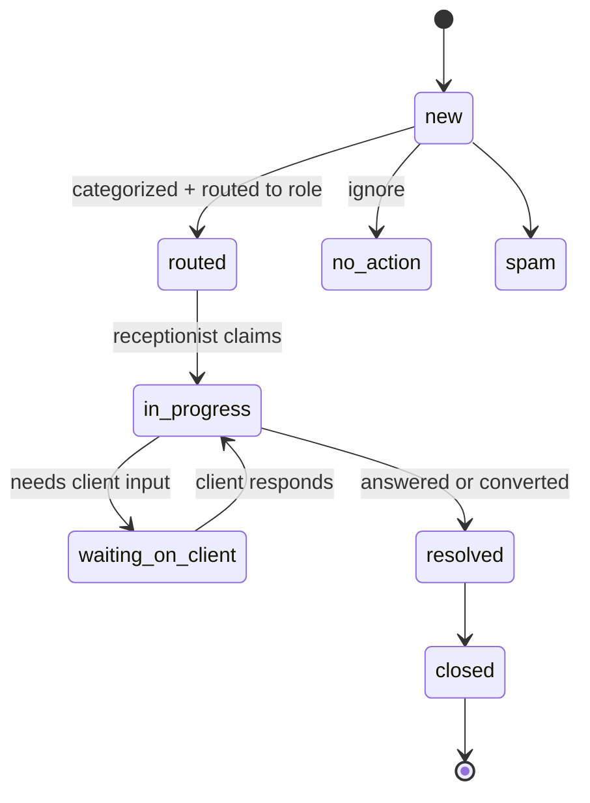
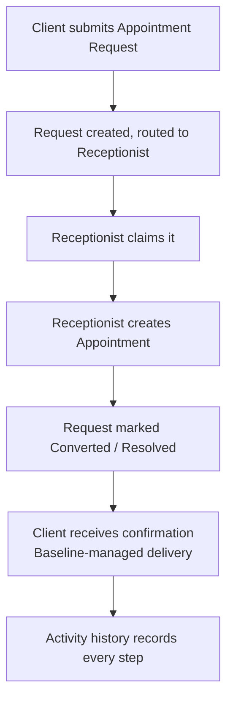

# ADR-0001 — Request Engine as a Core Engine

- **Status:** Accepted. v1 scope decided; integration complexity explicitly deferred. Implementation is **gated** on the reusable minimum-safe-foundation templates — see "Foundation gate" below.
- **Date:** 2026-08-04
- **Deciders:** Lead Architect (Baseline Studio); multi-round architecture review.
- **Related:** [`Architecture.md`](../Architecture.md), [`Workflow-Engine.md`](../Workflow-Engine.md), [`Permission-System.md`](../Permission-System.md), [`Data-Model.md`](../Data-Model.md)
- **Process:** This ADR closes the **Review** phase (Discussion → Spec → Review → **ADR** → Implementation → Code Review → Merge). Implementation of the v1 slice begins **only after** the Foundation gate (below) is cleared and tenant isolation is verified.

## Context

Today a practice's clients email random inboxes and call; nothing is tracked in one place. The guiding lens is *"every communication is really a request for work"* — a useful lens, **not a literal law** (a "thanks", an out-of-office, or spam is not a request). Communication providers (Google Workspace, Microsoft 365, SMS, future internal messaging) are **delivery channels**, not the system of record.

Two product principles govern the design:

- **Enhance familiar tools before replacing them.** Baseline orchestrates Gmail / Calendly / Drake / QuickBooks through one workflow; it does not rebuild them.
- **Every major capability is provider-agnostic.** Communication, Documents, Scheduling, and Payments support interchangeable providers without changing the business workflow.

This ADR records the outcome of a multi-round review (initial design → adversarial review → architect disagreements → convergence). It decides *what* the Request Engine is and *what ships first*, and it names what remains open.

## Decision

Adopt the **Request Engine** as a permanent Core Engine of Baseline Practice OS, with a deliberately narrow charter so it orchestrates the other engines rather than absorbing them.

### Charter

> Intake, categorization, routing, assignment, and lifecycle of a **request for work** — orchestrating work, communication, and notification, **never owning them**.

- **Owns:** intake, category, routing, assignment, request lifecycle/status, resolution.
- **Does not own:** the professional work (engagements / appointments / tasks); transition mechanics (Workflow Engine); notification and correspondence delivery (Notification Engine / Integration Engine); provider adapters and sync (Integration Engine).

### Boundaries

| Concept | Owns | Must not own |
|---|---|---|
| Request Engine | Intake, categorization, routing, assignment, request lifecycle, resolution | Professional work; provider delivery internals; notification delivery |
| Workflow Engine | States, transitions, guards, transition execution | Request-specific product meaning |
| Integration Engine | Provider adapters, inbound/outbound sync, provider IDs, delivery/sync status | Request assignment or lifecycle decisions |
| Notification Engine | One-way alerts about requests | Two-way client correspondence |
| Activity Events | Immutable audit history | Mutable state or full message threads |
| Engagements / Appointments / Tasks | Professional work, scheduled time, actionable steps | General intake and triage |

## Decided

1. The Request Engine is a **Core Engine** (cross-industry, provider-agnostic), not a CPA-module concept.
2. It **consumes the Workflow Engine** — request states/guards are declared as a workflow definition and run through the shared `transition()` machinery. It does **not** implement a second transition system.
3. `requests` (mutable state), `request_messages` (correspondence), and `activity_events` (immutable audit) are **three distinct records**. Message content is never folded into activity events.
4. **Portal-originated request content is stored by Baseline** — it *is* the request, and must remain visible, auditable, and secure.
5. **Provider-originated email sync (inbound Gmail) is deferred** — not in v1. Removing it dissolves the "is Baseline a complete copy of Gmail?" authority problem.
6. **Outbound v1 delivery uses a Baseline-managed transactional email provider or in-app notification.** No Google Workspace OAuth in v1. Delivery sits behind a Notification interface so the engine does not depend on one vendor.
7. **Baseline owns workflow state; the provider owns message delivery.** Operational state (assignment, priority, status, resolution) is updated in Baseline even when prose correspondence happens over email.
8. **Tenancy:** Rosa may run a **dedicated deployment**, but **one shared codebase is mandatory, with no client-specific fork**. Every record carries `org_id`; RLS is organization-scoped; deployment differences are **configuration, not source divergence**.
9. **Pooled-infrastructure transition is triggered by documented operational thresholds** (maintenance time across deployments, release/migration overhead, backup burden, cost per tenant, proven RLS confidence) — **not** by a customer count.
10. **v1 includes exactly one conversion path:** `Appointment Request → Appointment`. Engagement and task conversion are deferred to v1.1.

## v1 Scope

| Included in v1 | Deferred |
|---|---|
| Portal request submission | Gmail inbox ingestion |
| Fixed seeded categories | Google OAuth mailbox access |
| Organization-scoped records | Guaranteed two-way sync |
| Role routing + user claiming | Conversion to engagement |
| Request statuses & transitions (via Workflow Engine) | Conversion to arbitrary tasks |
| Staff request list | Advanced queues |
| Client request-status view | Tenant-facing category editor |
| Portal response history (stored) | SMS and voice |
| Activity events | AI classification |
| Baseline-managed outbound notification | Full provider email-body storage |
| One conversion path: Appointment Request → Appointment | SLA escalation engine |

## Data model (v1 — conceptual, no DDL)

All tables carry `org_id references organizations(id)`.

- **requests** — `client_id`, `category_id`, `status`, `priority`, `subject`, `body` (portal-originated, stored), `assigned_role` (routing target/queue), `assigned_user_id` (current owner/claimant), `resolution`, timestamps, `deleted_at`.
- **request_messages** — `request_id`, `direction` (in/out), `author`, `body` / `body_ref`, `provider` (nullable in v1; outbound is Baseline-managed), `provider_message_id` (nullable), `delivery_status`, `created_at`. **Threading token is optional** at the interface, so a future SMS channel needs no interface change.
- **request_categories** — `key`, `label`, default routing role. **Seeded; no tenant-facing editor in v1.** In the first slice this is a **global** lookup — a **provisional MVP simplification**, not the target model; see [Provisional decisions](#provisional-decisions-mvp-simplifications).
- **request_relations** — `(request_id, entity_type, entity_id, relation)`. v1 uses it for the `Appointment` link; ready for engagement/task later without new columns.
- **Reused:** `activity_events` (audit of every step), `notifications` (system alerts).

**v1 request status set:** `new · routed · in_progress · waiting_on_client · resolved · closed`, with off-ramps `no_action · spam`. **Resolution:** `answered · converted · duplicate · no_action · spam`. Claiming sets `assigned_user_id` (an assignment, not a separate status).

### Request lifecycle (v1)

## The v1 vertical slice (implementation target)

Constraints: org-scoped from day one · one shared codebase · no client fork · no Gmail OAuth · outbound via a Baseline-managed adapter behind a Notification interface · request lifecycle runs on the Workflow Engine.

## Dependencies (surface before the sprint)

- **The Appointment entity and its state machine must already exist** — it is the conversion target for the one v1 path. If not built, that is part of this slice's cost.
- **Org scoping must be present in the schema even for the dedicated deployment** (`org_id` on every table + `current_org()` / RLS helpers). "Dedicated" is a topology choice; it never justifies skipping org scope.

## Release criteria (adoption is a gate, not a footnote)

Technical completion is **not** release. The Rosa pilot must validate these before the engine expands:

1. **Clients use categorized portal requests** rather than email/phone. — *Metric: % of client contacts arriving via portal vs. email/phone.*
2. **The receptionist consistently reviews, claims, and updates requests.** — *Metric: median time-to-claim.*
3. Rosa trusts the request list as an operational view.
4. Appointment conversion reflects the real office workflow.
5. **The Request Engine reduces interruptions** rather than creating another inbox.
6. Clients understand general support vs. paid professional advice.

Assumptions 1, 2, and 5 are make-or-break and carry the two hard metrics above. Expansion of the engine is gated on this evidence, not on technical completion alone.

## Still open

- **Later Gmail OAuth** scopes and token-management design (minimal scopes — prefer send/label over full-mailbox read; encryption-at-rest; per-tenant token isolation; revocation).
- **Inbound-email synchronization strategy** (threading via a stable reference token; dedup on `provider_message_id`; sync-health surfacing; idempotent ingest).
- **Background-job / outbox substrate** selection — prerequisite for inbound sync, SLA timers, retries, and routing automation.
- **Pooled-infrastructure transition thresholds** — the actual metrics/numbers behind Decided #9.
- **Engagement and task conversion behavior** (v1.1).
- **Retention rules for portal request content.** *Set a default now* — retain for the request/engagement lifecycle; deletable on client request — and finalize the policy before real client data accumulates. (v1 already stores this content, so this cannot stay fully open.)
- **Future provider-capability model** — formal channel capability tiers, added when a second materially different channel (e.g., SMS) is approved.
- **Whether/when to unify `consultation_requests` into Requests** — only after public-intake protections are preserved (server-side validation, rate limiting, bot protection, no anonymous read).
- **Category scoping** — `request_categories` is a **global** seeded lookup in v1; the target is **org/module-scoped** catalogs. Provisional — see [Provisional decisions](#provisional-decisions-mvp-simplifications).

## Provisional decisions (MVP simplifications)

Decisions taken to ship the first slice that are **explicitly not** the long-term architecture. They are recorded here so future modules (Legal, Medical, Insurance, …) do not inherit them as settled platform assumptions.

### PD-1 — `request_categories` is a global seeded lookup (v1 only)

- **What shipped.** One global `request_categories` table (keyed by `key`, no `org_id`), seeded by migration, read-only via RLS. The Appointment Request slice (`supabase/008_requests.sql`) uses it.
- **Why (v1 only).** ADR-0001 fixes the category set and defers a tenant-facing editor, so a *fixed* list was sufficient. More decisively, there is **no org-provisioning seam yet** — no hook that runs at organization creation to seed per-org rows — so an `org_id`-scoped table could not be seeded from a migration. Global was the cheapest correct option for one CPA slice.
- **Why this is NOT the target.** A multi-industry platform cannot share one category vocabulary: a CPA's "Appointment request," a Legal practice's "Discovery request," and a Medical practice's "Referral request" do not belong in one flat global list. Categories are inherently **module/industry-scoped** and eventually **org-customizable**.
- **Target architecture.** Each **module** owns a category catalog; each **org** is seeded from its module's catalog at provisioning; every category row carries **`org_id`** (a nullable `org_id` may denote system defaults, with per-org rows overriding). Org add/rename lands later behind the deferred tenant editor.
- **Migration path (additive, non-breaking).** `requests` reference a category **by key**, so scoping is added, not rewritten: (1) add nullable `org_id` to `request_categories`; (2) introduce an org-provisioning seed step that copies the module catalog into per-org rows; (3) make category resolution org-aware — composite `(org_id, key)` — and backfill existing requests; (4) retire reliance on global rows. No `requests` data is invalidated at any step.
- **Constraint on future modules.** Do **not** extend the global list with other industries' categories, and do **not** treat "categories are global" as a platform invariant. Build new request types against a **scoped** catalog; if the org-provisioning seam still doesn't exist when a second module starts, building it is part of that module's cost — not another global extension.
- **Trigger to promote this to a real decision.** The **second industry module**, or the **first org-provisioning seam**, whichever comes first. At that point this provisional note is replaced by a full ADR for the scoped category model.

## Consequences

### Positive

- One front door and one place to track intake; immediate customer value for Rosa.
- Ships without a big-bang integration or a platform rewrite; the hardest problem (inbound sync) does not gate the core workflow.
- Preserves the provider-agnostic seam and the orchestrator boundary for future channels.

### Costs / risks (and mitigations)

- The portal is a second surface staff must adopt → mitigated by making adoption a measured release gate.
- Storing sensitive portal content creates retention/privacy responsibility → mitigated by setting a default retention policy before real data accumulates.
- A dedicated deployment could drift into a per-client fork → mitigated by mandatory org scoping, one shared codebase, and a threshold-based pooled off-ramp.
- Staff replying outside Baseline won't appear in the portal → stated plainly in training as a v1 limitation; controlled Gmail sync is a later phase.

## Foundation gate (blocks implementation)

Feature development is **paused** until the reusable platform templates reach the **minimum safe foundation**. The Request Engine builds on top of this; it must not be the thing that introduces it. Required before any Rosa Request Engine code:

- **Schema** — `organizations` + `org_id` on every business table; **identity vs. membership** (`profiles` = the global person, `memberships` = org + role); a generic core spine (`clients`, `engagements`, `appointments`, `documents`, `tasks`).
- **RLS** — org-scoped policies on every table, backed by org-aware `security definer` helpers (`is_member` / `is_staff` / `is_admin` / `my_client_id`).
- **Routing / authz** — a single source of truth (`lib/authz.ts`): capability matrix + org/role resolution from memberships, mirrored by RLS. The role router resolves the active org and role from memberships, not from a `profiles.role` column.
- **Verification** — a runnable tenant-isolation test (`templates/supabase/tests/rls_isolation.test.sql`) that proves one org cannot read another's rows. Isolation is *proven*, not assumed.

See [`../../references/foundation.md`](../../references/foundation.md) for the standard and the checklist. Only once the foundation is in place and isolation verified does the appointment-request slice begin.

## Directive

Stop expanding the Request Engine. No new engines, channels, configuration systems, or generalized provider frameworks during this sprint. Record these decisions, implement the thin appointment-request slice, and review adoption evidence before expanding.
